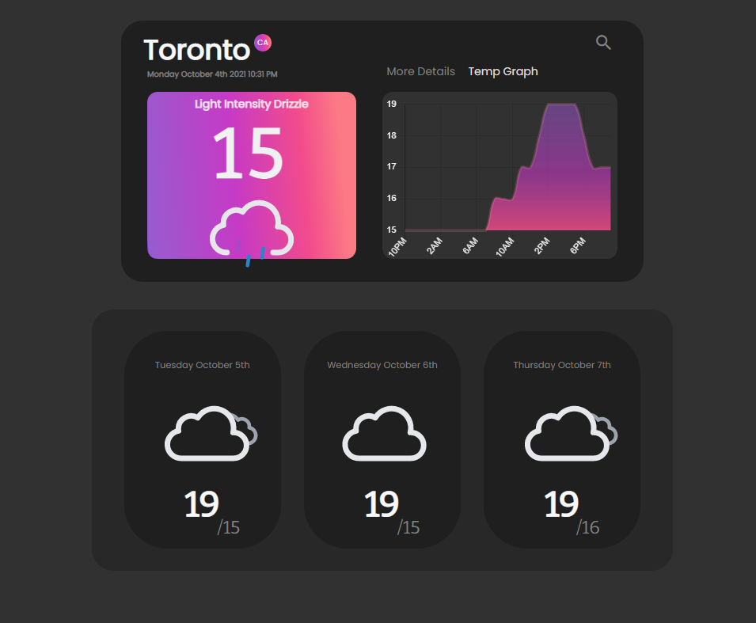

# Weather-Forcaster

<!--TABLE OF CONTENTS-->
<ol>
  <li><a href="#about-the-project">About The Project</a></li>
  <li><a href="#getting-started">Getting Started</a></li>
    <ul>
      <li><a href="#dependencies">Dependencies</a></li>
      <li><a href="#installation">Installation</a></li>
    </ul>
  <li><a href="#acknowledgements">Acknowledgements</a></li>
</ol>

<!-- ABOUT THE PROJECT -->
## About The Project
Simple weather forcast web application practicing Vue components and hooks.




## Getting Started

<a href="https://vuejs.org/"><b>Vue.js</b></a> is required to run this program.

### Dependencies

npm
```sh
npm install -g npm
```
chart.js
```sh
npm install chart.js
```
date-fns/ date-fns-tz
```sh
npm install date-fns date-fns-tz
```
vue3 chart js wrapper
```sh
npm install vue3-chart-v2
```

### Installation

Compiles and hot-reloads for development
```sh
npm run serve
```
Compiles and minifies for production
```sh
npm run build
```
  
  
## Acknowledgements
<a href="https://github.com/basmilius/weather-icons">Basmilius Weather Icons</a>


